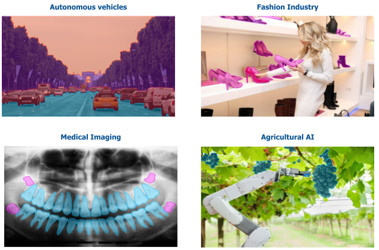
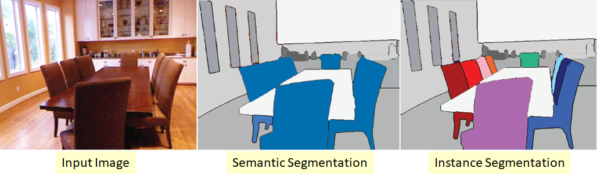

# thinkautonomous_imageSegmentation
Repo contains content created a for `IMAGE SEGMENTATION COURSE` offered at [thinkautonomous.ai](https://courses.thinkautonomous.ai/image-segmentation). This post is a gist of what the course teaches for anyone willing to learn about <u>Semantic Segmentation using Modern Deep Learning</u>

## Agenda
- [Problem Statement](#problem-statement)
- [Applications](#applications)
- [Semantic vs Instance Segmentation](#semantic-vs-instance-segmentation)

## Problem Statement
- Goal of Semantic Segmentation is to `Classify each pixel in an image belonging to a certain class`
- The label for each pixel itself can be <u>discrete (like object type -car, human, tree, etc) or continous (distance of object from sensor)</u>

[Image source](https://www.researchgate.net/figure/Semantic-segmentation-of-a-scene-from-the-Cityscapes-dataset-by-Cordts-et-al-2016_fig24_316270100)

## Applications
- Semantic segmentation can be applied wherever Image and Image-like data is available, hence has numerous use-cases some of which are highlighted below

[Image source](https://keymakr.com/blog/semantic-segmentation-uses-and-applications/)

## Semantic vs Instance Segmentation
- Semantic Segmentation doesn't differentiate across different instances of the same object while Instance Segmentation does

