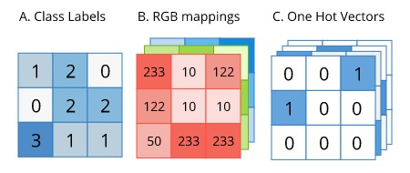
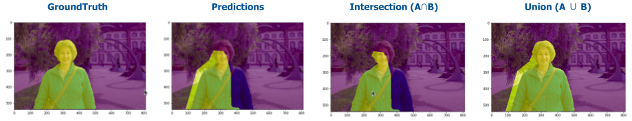

# thinkautonomous_imageSegmentation
Repo contains content created a for `IMAGE SEGMENTATION COURSE` offered at [thinkautonomous.ai](https://courses.thinkautonomous.ai/image-segmentation). This post is a gist of what the course teaches for anyone willing to learn about <u>Semantic Segmentation using Modern Deep Learning</u>

<!-- Semantic Segmentation Pytorch Deeplabv3+ -->

## Agenda
- [Problem Statement](#problem-statement)
- [Deep Learning Project Components](#deep-learning-project-components)
- [Dataset](#dataset)
- [Loss function](#loss-function)
- [Metric](#metric)
- [Model]()
- [HyperParameters]()
- [Results]()
    - [Model wise comparison](#model-wise-comparison)
    - [Costa Rica Challenge](#costa-rica-challenge)

- [Inference Strategy](#inference-strategy)
- [Annexure]()
    - [References](references.md)
    - [Applications](#applications)
    - [Semantic vs Instance Segmentation](#semantic-vs-instance-segmentation)

## Problem Statement
- **Multi-class Segmentation Problem** - specifically to classify each pixel in an image to one of following 3 classes:
    - Direct / current lane (label 0)
    - Alternative lane (label 1)     
    - Background (label 2)

## Deep Learning Project Components
- Following are the key areas of focus when trying to solve any Deep Learning Project PoC 

## Dataset
- We use the `Driveable Area` segment from [BDD100K dataset](https://www.bdd100k.com/) dataset for our project
- 3k labeled images split randomly into train, validation and test images (2.1k, 0.6k and 0.3k) 

- Labels are converted to type A as its smaller and efficient to work with
- As with most semantic segmentation datasets, there is data imbalance

| Class      | % in Dataset |
| ----------- | ----------- |
| Direct lane      |11.7%      |
| Alternate lane   | 4.7%       |
| Background   | 83.6%      |
- **We'll need to account for class imabalance when selecting the loss function and metric**
- Not much Data Augumentation was applied other than *Normalization using Imagenet mean, standard deviation**

## Loss function
- As mentioned earlier, Loss function must be able to handle class imbalance
- Problems in Medical image processing face similar issues and we can take cues from approaches taken there

| Loss function      | Use case |
| ----------- | ----------- |
| Multi-class Cross entropy     |Multi-class version with option for weights for different classes      |
|Focal Loss  | Highly-imbalanced dataset, down-weight the contribution of easy examples, enabling model to learn hard examples      |
| Dice Loss   | Inspired from Dice Coefficient, a segmentation metric.
Suitable for imbalanced datasets |
| Tversky Loss | Variant of Dice Coefficient. Add weight to False positives and False negatives.     |

- Considering the imbalance in the dataset and literature review, **Dice loss** is chosen as loss function. Dataset is imbalanced, but not to the extreme levels of Medical Image segmentation where Focal loss could have better results

## Metric
- As Semantic segmentation is an extension of classification problem, classification metrics like Accuracy, Precision, Recall, F1 score can also be applied
- Considering imbalanced nature of dataset, **mean IoU** is chosen as Evaluation Metric.
- Also, it's the **industry standanrd for most segmentation tasks**

[Image reference](https://www.jeremyjordan.me/evaluating-image-segmentation-models/)

## Models

## Results

### Model wise comparison

### Costa Rica Challenge

## Inference Strategy

[Image source](https://www.researchgate.net/figure/Semantic-segmentation-of-a-scene-from-the-Cityscapes-dataset-by-Cordts-et-al-2016_fig24_316270100)

### Applications
- Semantic segmentation can be applied wherever Image and Image-like data is available, hence has numerous use-cases some of which are highlighted below

[Image source](https://keymakr.com/blog/semantic-segmentation-uses-and-applications/)

### Semantic vs Instance Segmentation
- Semantic Segmentation doesn't differentiate across different instances of the same object while Instance Segmentation does

