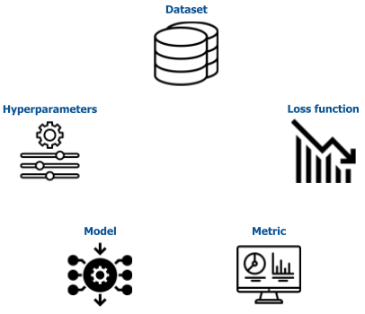
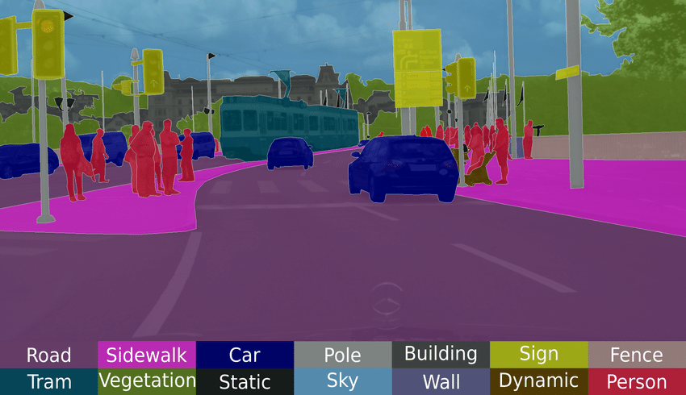

# thinkautonomous_imageSegmentation
Repo contains content created a for `IMAGE SEGMENTATION COURSE` offered at [thinkautonomous.ai](https://courses.thinkautonomous.ai/image-segmentation). This post is a gist of what the course teaches for anyone willing to learn about <u>Semantic Segmentation using Modern Deep Learning</u>

Semantic Segmentation Pytorch Deeplabv3+

## Agenda
- [Problem Statement](#problem-statement)
- [Deep Learning Project Components](#deep-learning-project-components)
- [Dataset]()
- [Loss function]()
- [Metric]()
- [Model]()
- [HyperParameters]()
- [Results]()
    - [Model wise comparison](#model-wise-comparison)
    - [Costa Rica Challenge](#costa-rica-challenge)

- [Inference Strategy](#inference-strategy)
- [Annexure]()
    - [References](references.md)
    - [Applications](#applications)
    - [Semantic vs Instance Segmentation](#semantic-vs-instance-segmentation)

## Problem Statement
- **Multi-class Segmentation Problem** - specifically to classify each pixel in an image to one of following 3 classes:
    - Direct / current lane (label 0)
    - Alternative lane (label 1)     
    - Background (label 2)

## Deep Learning Project Components
- Following are the key areas of focus when trying to solve any Deep Learning Project PoC 

## Dataset
- We use the `Driveable Area` segment from [BDD100K dataset](https://www.bdd100k.com/) dataset for our project
- 3k labeled images split randomly into train, validation and test images(2.1k, 0.6k and 0.3k) 
- 

- It's a diverse dataset containing > 1000 hours of annotations for **Multi-Task Learning** tasks like Object Detection, Semantic, Instance Segmentation

## Results

### Model wise comparison

### Costa Rica Challenge

## Inference Strategy

[Image source](https://www.researchgate.net/figure/Semantic-segmentation-of-a-scene-from-the-Cityscapes-dataset-by-Cordts-et-al-2016_fig24_316270100)

### Applications
- Semantic segmentation can be applied wherever Image and Image-like data is available, hence has numerous use-cases some of which are highlighted below

[Image source](https://keymakr.com/blog/semantic-segmentation-uses-and-applications/)

### Semantic vs Instance Segmentation
- Semantic Segmentation doesn't differentiate across different instances of the same object while Instance Segmentation does

