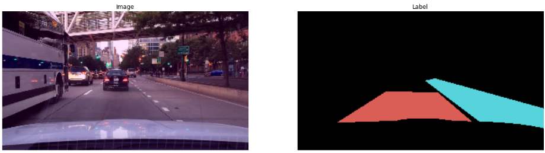

# thinkautonomous_imageSegmentation
Repo contains content created a for `IMAGE SEGMENTATION COURSE` offered at [thinkautonomous.ai](https://courses.thinkautonomous.ai/image-segmentation). This post is a gist of what the course teaches for anyone willing to learn about <u>Semantic Segmentation using Modern Deep Learning</u>

<!-- Semantic Segmentation Pytorch Deeplabv3+ -->

- [***For people already aware of fundamental concepts, here's a deepdive into SEGFORMERS -one of SOTA for Segmentation tasks***](Segformer_deepdive.md)
- [***For people interested in Deployment strategies - here's a deepdive into Neural  Optimization techniques***](https://github.com/suryajayaraman/thinkAutonomous_modelOptimization/blob/main/README.md)

## Agenda
- [Problem Statement](#problem-statement)
- [Deep Learning Project Components](#deep-learning-project-components)
- [Dataset](#dataset)
- [Loss function](#loss-function)
- [Metric](#metric)
- [Models](#models)
- [HyperParameters](#hyperparameters)
- [Results](#results)
    - [Model wise comparison](#model-wise-comparison)
    - [Costa Rica Challenge](#costa-rica-challenge)
- [Things that didn't work](#things-that-didnt-work)
- [Annexure](#annexure)
    - [References](references.md)
    - [Applications](#applications)
    - [Semantic vs Instance Segmentation](#semantic-vs-instance-segmentation)

## Problem Statement
- **Multi-class Segmentation Problem** - specifically to classify each pixel in an image to one of following 3 classes:
    - Direct / current lane (label 0)
    - Alternative lane (label 1)     
    - Background (label 2)

## Deep Learning Project Components
- Following are the key areas of focus when trying to solve any Deep Learning Project PoC 

## Dataset
- We use the `Driveable Area` segment from [BDD100K dataset](https://www.bdd100k.com/) dataset for our project
- 3k labeled images split randomly into train, validation and test images (2.1k, 0.6k and 0.3k) 
- Input Image -> (360, 640, 3) RGB image and labels -> (360, 640) **uint8 datatype**

- Labels are converted to type A as its smaller and efficient to work with
- As with most semantic segmentation datasets, there is data imbalance

| Class      | % in Dataset |
| ----------- | ----------- |
| Direct lane      |11.7%      |
| Alternate lane   | 4.7%       |
| Background   | 83.6%      |
- **We'll need to account for class imabalance when selecting the loss function and metric**
- No Data Augumentation was applied other than *Normalization using Imagenet mean, standard deviation**

## Loss function
- As mentioned earlier, Loss function must be able to handle class imbalance
- Problems in Medical image processing face similar issues and we can take cues from approaches taken there

| Loss function      | Use case |
| ----------- | ----------- |
| Multi-class Cross entropy     |Multi-class version with option for weights for different classes      |
|Focal Loss  | Highly-imbalanced dataset, down-weight the contribution of easy examples, enabling model to learn hard examples      |
| Dice Loss   | Inspired from Dice Coefficient, a segmentation metric. Suitable for imbalanced datasets |
| Tversky Loss | Variant of Dice Coefficient. Add weight to False positives and False negatives.     |

- **Considering the imbalance in the dataset and literature review, Dice loss is chosen as loss function**. Dataset is imbalanced, but not to the extreme levels of Medical Image segmentation where Focal loss could have better results

## Metric
- As Semantic segmentation is an extension of classification problem, classification metrics like Accuracy, Precision, Recall, F1 score can also be applied
- Considering imbalanced nature of dataset, **mean IoU** is chosen as Evaluation Metric.
- Also, it's the **industry standanrd for most segmentation tasks**

[Image reference](https://www.jeremyjordan.me/evaluating-image-segmentation-models/)

## Models
- Following model architectures were considered:
    - [FCN with resnet50 backbone](finalContent/FCN_resnet50_baseline.ipynb)
    - [UNet with 4-level Encoder Decoder](finalContent/UNet_Run.ipynb)
    - [PSPNet with resnet50 backbone, aux branch](finalContent/PSPNet_resnet50_aux.ipynb)
    - [Deeplabv3+ with resnet50 backbone](finalContent/deeplabv3_plus_resnet50_os8.ipynb)
    - [Segformer MiT B3](finalContent/Segformer_mit_b3.ipynb)

- Models using resnet50 backbone used the same pretrained weights for justified comparison.
- All of these models try to tackle the following problems in their own way:
    - <u>Multi-scale nature of objects</u>
    - <u>Finding Global context of environment</u>
    - <u>Tradeoff between global context and local semantics</u>
- [UNet](finalContent/UNet_starter.ipynb) uses Encoder-Decoder architecture with skip-connections to get accurate borders
- [PSPNet](finalContent/PSPNet_Blocks.ipynb) uses Spatial Pyramid Pooling to set Global context prior and auxiliary branch from 3rd layer to speed up training
- [Deeplabv3+](finalContent/DeepLabv3%2B_Blocks.ipynb) uses Atrous convolutions, Atrous Spatial Pyramid Pooling and Encoder-Decoder architecture
- [Segformers](finalContent/Segformer_Blocks.ipynb) uses [Efficient Self-Attention](finalContent/Efficient_self_attention_intuition.ipynb) along with Mix-FFN, Overlap Patch embedding

## HyperParameters
- All models had similar training procedures as follows:
    - Batch size of 8 
    - Backbones initialized with pretrained weights and no layers were frozen during training
    - Adam optimizer with OneCycle LR Scheduler with initial learning rate = 3e-4, cosine annealing with 30% ascend
    - 12 epochs of training where model with lowest Dice loss was taken as best model

## Results

### Model wise comparison

| Model      | meanIoU (%) | Weight Size (MB) |
| ----------- | ----------- | ----------- |
| FCN-resnet50       | 69.56% |  133 MB |
| UNet     | 65.44% |  118 MB |
| PSPNet-resnet50      | 75.49% |  187 MB |
| Deeplabv3+-resnet50  | 73.05% |  154 MB |
| Segformer MiT B3 | 77.07% |  170 MB |

- As seen in table, Segformer achieves the highest meanIoU with model weight size ~170MB with its Multi-scale Transformer + all MLP decoder
- Deeplabv3+ scores 2% meanIoU lesser than PSPNet, is ~20% lighter. The lesses meanIoU might be down to Overfitting as Deeplabv3+ is more SOTA than PSPNet. There's also a variant with Xception backbone which is faster, memory-efficient too

### Costa Rica Challenge
- As a fun challenge, trained models were evaluated on unseen / very different scenario of Streets in Costa Rica
- **Inspite of different environment and lot of shadows, the model performance is very robust**

## Things that didn't work
- Freezing backbone and training the Classification head alone
- Cross-Entropy / Weighted CE loss functions peformed poorly compared to diceloss
- Different Optimizer like SGD with momentum, AdamW, Adagrad didn't improve results
- Different LR schedulers like CosAnnealing with Warm Restarts, PolyLR also couldn't provide better meanIoU

## Annexure

### Applications
- Semantic segmentation can be applied wherever Image and Image-like data is available, hence has numerous use-cases some of which are highlighted below

[Image source](https://keymakr.com/blog/semantic-segmentation-uses-and-applications/)

### Semantic vs Instance Segmentation
- Semantic Segmentation doesn't differentiate across different instances of the same object while Instance Segmentation does

