# thinkautonomous_SEGFORMERS
Repo contains content created for `SEGFORMERS COURSE` offered at [thinkautonomous.ai](https://courses.thinkautonomous.ai/image-segmentation). This post is a gist of what the course teaches for anyone willing to learn about <u>Attention mechanism, Transformers, Semantic Segmentation using Segformers</u>

- This post is 2nd in series of Semantic Segmentation using Modern Deep Learning. [*Check out the 1st post to start with fundamental concepts of Semantic segmentation*](README.md)
- [*For people interested in Deployment strategies - here's a deepdive into Neural  Optimization techniques*](https://github.com/suryajayaraman/thinkAutonomous_modelOptimization/blob/main/README.md)
- [***CLICK HERE TO CHECK OUT ALL OF MY PROJECTS***](https://suryajayaraman.github.io/)

## Agenda
- [Problem Statement](#problem-statement)
- [Deep Learning Project Components](#deep-learning-project-components)
    - [Dataset](#dataset)
    - [Loss function](#loss-function)
    - [Metric](#metric)
- [Attention Mechanism](#attention-mechanism)
- [Transformers](#transformers)
    - [Self-Attention](#self-attention)
    - [Query, Key and Value](#query-key-and-value)
    - [Multi-Head Self-Attention](#multi-head-self-attention)
    - [Pros and Cons of Transformer]()
- [Vision Transformers](#vision-transformers)
    - [Intuition of ViT](#intuition-of-vit)
- [Segformers](#segformers)
    - [Overlap Patch Embedding](#overlap-patch-embedding)
    - [Efficient self-attention](#efficient-self-attention)
    - [Mix FFN](#mix-ffn)
    - [Transformer block](#transformer-block)
    - [All MLP Decoder](#all-mlp-decoder)
- [HyperParameters](#hyperparameters)
- [Results](#results)
- [Visualizing Attention Mask](#visualizing-attention-mask)
- [Things that didn't work](#things-that-didnt-work)

## Problem Statement
- **Multi-class Segmentation Problem** - specifically to classify each pixel in an image to one of 19 classes:

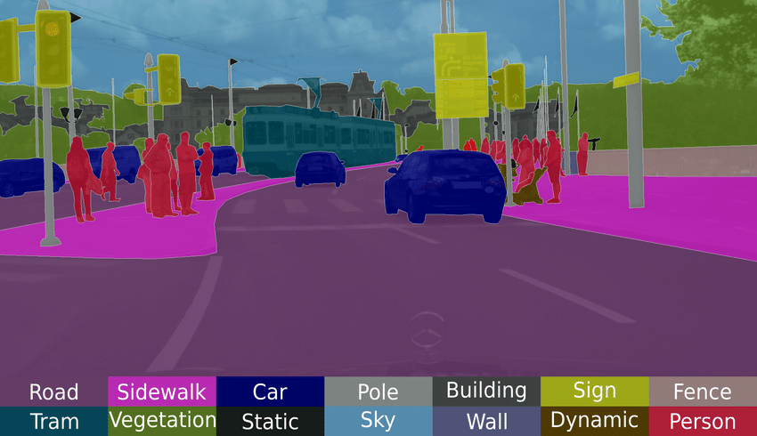

## Deep Learning Project Components

## Dataset
We use the `Semantic Segmentation` segment from [Cityscapes dataset](https://www.cityscapes-dataset.com/) for our project
- 3.5k labeled images split randomly into train, validation and test images (2.38k, 0.595k and 0.5k). Input Image -> (512, 1024, 3) RGB image and labels -> (512, 1024) **uint8 datatype**
- As with most semantic segmentation datasets, there is data imbalance:

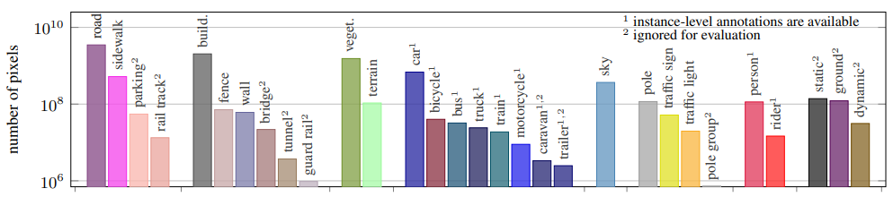

[Image reference](https://www.cityscapes-dataset.com/wordpress/wp-content/papercite-data/pdf/cordts2016cityscapes.pdf)

- **We'll need to account for class imbalance when selecting the loss function and metric**. As for pre-processing, No Data Augumentation was applied other than *Normalization using Imagenet mean, standard deviation*
- [Cityscapes scripts git repo](https://github.com/mcordts/cityscapesScripts) is the official place containing useful scripts to help you get started on the dataset.

## Loss function
As mentioned earlier, Loss function must be able to handle class imbalance. Personally, I expected Dice loss to perform better than normal Cross Entropy, but <u>CE loss was >> than Dice loss </u>
- [This post](https://stats.stackexchange.com/questions/321460/dice-coefficient-loss-function-vs-cross-entropy) proposes that 
Gradients are nicer in CE compared to Dice loss
- In hindsight, one can argue that with increased number of classes, Dice loss might result in *difficult to flow gradients* Hence, ***Cross Entropy loss is chosen as loss function***

## Metric
**mean IoU** is chosen as Evaluation Metric for 2 reasons:
- Imbalanced nature of dataset
- It's the <u>industry standanrd for most segmentation tasks</u>

## Attention Mechanism
- Attention mechanism originated in NLP domain. Traditionally, SOTA models at that time had Encoder-Decoder architecture which would contain sequence of LSTM / RNN modules
- For case of Machine Translation, Each word in input sentence would be parsed 1 by 1 and finally, <u> one single context vector is given to decoder to get output. But for very long sentences, this single context vector was not sufficient to remember relevant context for each word</u>

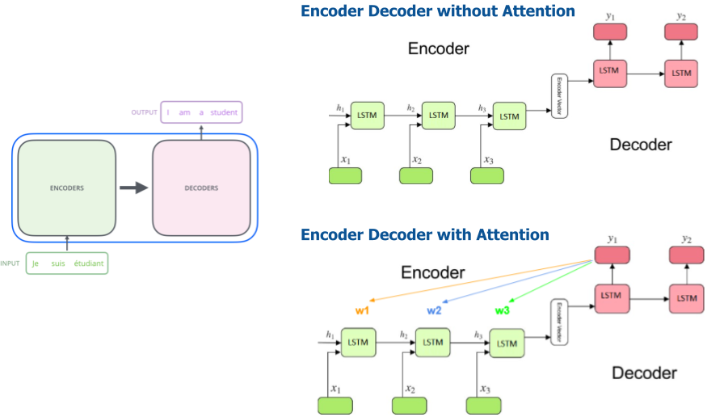

- This is where Attention mechanism was introduced. Instead of just giving a single context vector, for each output in decoder, the network was also given all the context from encoder and allowed to learn weights for each of them.
- **It allowed the network to learn which parts of input sentence to focus on when deciphering each word in decoder**

- So, Attention can be summarised as **giving different levels of importance (different weightage) to different parts of input**

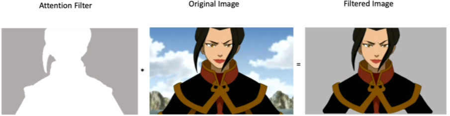

- Assuming above image is input to object classification, to classify it as human, we may need to focus more on human attributes like the face, hands and less on the background
- This weighting mechanism is <u>learned during training</u> and enables to <u>understand context at each stage of model</u>
- It also helps in increasing <u>model interpretability</u>

## Transformers
- [Transformers](https://arxiv.org/abs/1706.03762) is a revolutionary architecture **solely based on Attention mechanism** introduced originally for NLP domain for tasks like Machine Translation, Language to speech etc

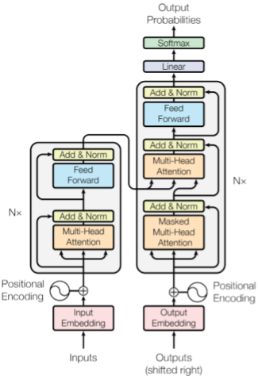

- Apart from Attention modules, there 3 components - Embedding layers (Input and Output embeddings), Normalised Residual connection (Add & norm) and Fully Connected layer (Feed Forward). These components together with Attention module form the core of any Transformer block

- Core module of transformer is **Multi-Head Self Attention**. We'll break down each of component step by step

### Self-Attention
- Self-Attention is Attention applied on itself

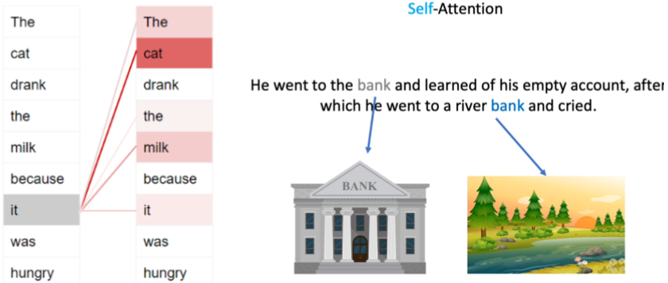

- In 1st example shown above, one can see that **when parsing the word `it`, more weightage is given to `cat` indicating the context model has learnt**
- In the 2nd example, the model must learn that **1st bank refers to the financial institution and 2nd to river bank, hence context for both words are different**

### Query, Key and Value
- Attention is achieved through Query-Key-Value mechanism
- Consider example of searching for some content in YouTube. We would enter title of our choice and YouTube would return most relevant results in order of how close they are to the words we entered. Here,
    - Query is the words we entered
    - Key is the title associated with each video
    - Value is the video itself

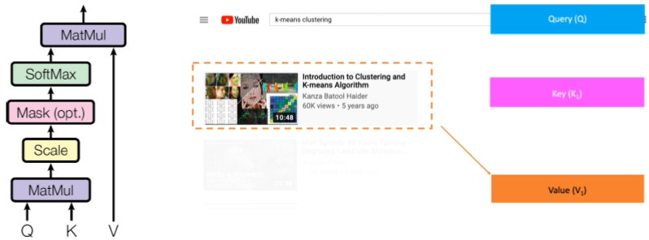

- We're comparing Query and Key and ranking results based on how close / relevant they're to each other
- In Linear Algebra, **one way to check relevance of one vector to another is Dot Product / cosine similarity**
- On a crude level, Dot product b/w Query (the words we entered) and Key (title of each video) is calculated and output is normalized to probability and videos with highest weights are shown as top results
- Actual steps : We compute Dot product b/w Query and Key which is softmax to give attention weights. Output is then calculated using weighted sum of values
- **Note that Query, Key and Value which enable Attention are learned when training the model**

### Multi-Head Self-Attention
- Multi-head self attention is simple extension of Self Attention
- We create multiple heads (branches) from same input, with each having its own Query, Key, Value and finally, we combine results from all heads which is passed on to next stage
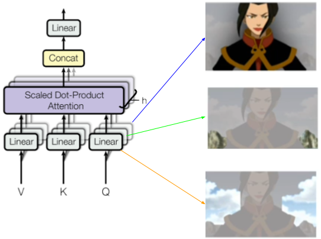
- Continuing our object classification example, one head might learn to segment human while another identifies greenery in background and another head tries to learn about sky etc
- This way, **different heads can focus on different perspectives to arrive at the result, providing more robust decision output**

### Pros and Cons of Transformer

<u>Pros</u>
- Transformers achieved better than SOTA metric compared to LSTM-variants while being ligter
- Its highly parallelizable architecture (>> better than LSTM and > than Convolution based models), enabling faster training
- Enabled Transfer Learning in NLP domain
- Much better Model Interpretability
- MLP layers offered better scope for Quantization and other optimization techniques compared to Convolution / LSTM modules

<u>Cons</u>
- Require huge amounts of data to realize the full potential of Transformer models
- They have larger memory footprint and slower in terms of absolute numbers

## Vision Transformers
- [Vision Transformers](https://arxiv.org/abs/2010.11929) is simply Transformers applied to image Input. 

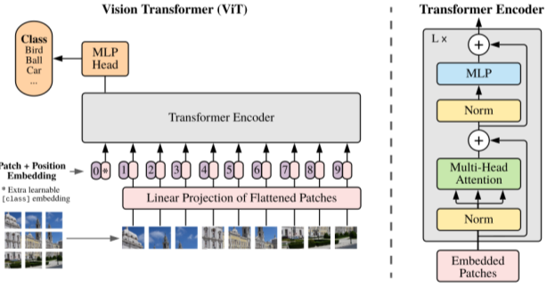

- Images separated into patches and each patch ~= word in sentence
- Position encoding to represent order of sequence
- After Encoder, any module can be used as decoder according to  target Task.
- As with any Transformer model, we can visualize the attention masks to see what the model is focussing on 

[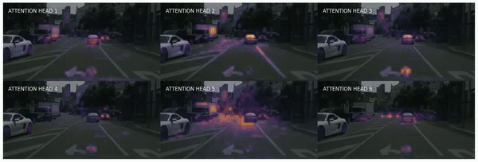](https://www.youtube.com/watch?v=n_zB-nEa3AI "ViT Attention heads visualization on Cityscapes dataset")

- In the above vide, we can see each of the Attention head is focussing on different aspects. eg : Attention heads 4 & 5 are focussing on traffic lights and car headlights, Attention head 6 is focussing mostly on far away objects etc

- <u>Note </u> : Vision Transformer doesn't use multi-scale features. Hence Encoder output is mostly an downsampled version of the input image by some factor

## Segformers
- Segformer is an Encoder-decoder version of Vision Transformer, for segmentation tasks
- Multi-scale problem tackled by feeding encoder outputs at different stages to decoder
- Decoder is simple MLP which combines multi-scale encoder outputs

- As seen above, there are 3 main parts in Transformer block of Encoder - Overlap Patch Embedding, Efficient self-attention and Mix-FFN. We'll cover these modules one by one.

### Overlap Patch Embedding
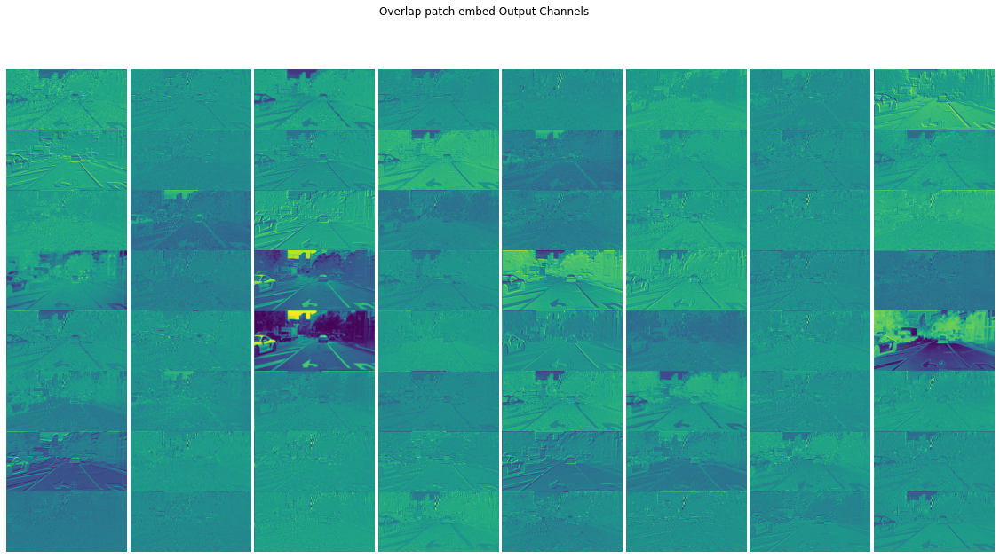

### Efficient self-attention
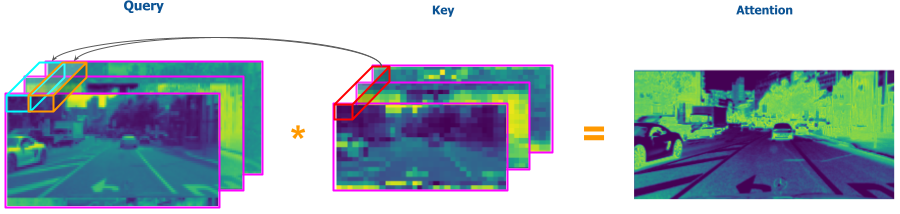

### Mix FFN

### Transformer block

### All MLP Decoder

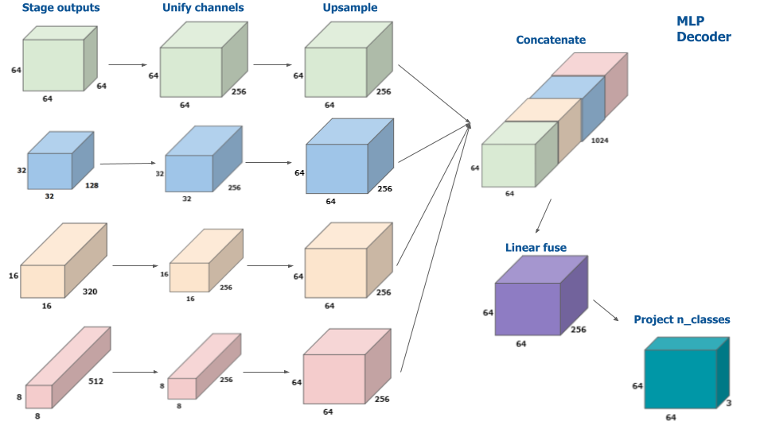
## HyperParameters
## Results
## Visualizing Attention Mask

