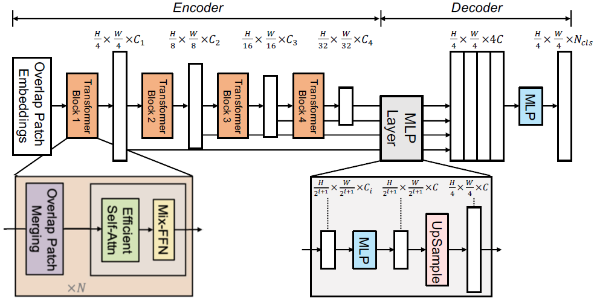
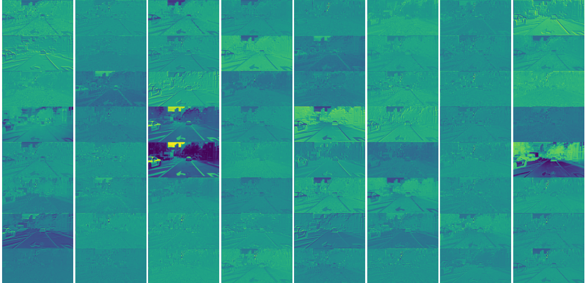

# thinkautonomous_SEGFORMERS
Repo contains content created for `SEGFORMERS COURSE` offered at [thinkautonomous.ai](https://courses.thinkautonomous.ai/image-segmentation). This post is a gist of what the course teaches for anyone willing to learn about <u>Attention mechanism, Transformers, Semantic Segmentation using Segformers</u>

- This post is 2nd in series of Semantic Segmentation using Modern Deep Learning. [*Check out the 1st post to start with fundamental concepts of Semantic segmentation*](README.md)
- [*For people interested in Deployment strategies - here's a deepdive into Neural  Optimization techniques*](https://github.com/suryajayaraman/thinkAutonomous_modelOptimization/blob/main/README.md)
- [***CLICK HERE TO CHECK OUT ALL OF MY PROJECTS***](https://suryajayaraman.github.io/)

## Agenda
- [Problem Statement](#problem-statement)
- [Deep Learning Project Components](#deep-learning-project-components)
    - [Dataset](#dataset)
    - [Loss function](#loss-function)
    - [Metric](#metric)
- [Attention Mechanism](#attention-mechanism)
- [Transformers](#transformers)
- [Vision Transformers](#vision-transformers)
    - [Intuition of ViT](#intuition-of-vit)
- [Segformers](#segformers)
    - [Overlap Patch Embedding](#overlap-patch-embedding)
    - [Efficient self-attention](#efficient-self-attention)
    - [Mix FFN](#mix-ffn)
    - [Transformer block](#transformer-block)
    - [All MLP Decoder](#all-mlp-decoder)
- [HyperParameters](#hyperparameters)
- [Results](#results)
- [Visualizing Attention Mask](#visualizing-attention-mask)
- [Things that didn't work](#things-that-didnt-work)

## Problem Statement
- **Multi-class Segmentation Problem** - specifically to classify each pixel in an image to one of 19 classes:

## Deep Learning Project Components
Following are the key areas of focus when trying to solve any Deep Learning Project PoC 

## Dataset
We use the `Semantic Segmentation` segment from [Cityscapes dataset](https://www.cityscapes-dataset.com/) for our project
- 3.5k labeled images split randomly into train, validation and test images (2.38k, 0.595k and 0.5k). Input Image -> (512, 1024, 3) RGB image and labels -> (512, 1024) **uint8 datatype**
- As with most semantic segmentation datasets, there is data imbalance:

[Image reference](https://www.cityscapes-dataset.com/wordpress/wp-content/papercite-data/pdf/cordts2016cityscapes.pdf)

- **We'll need to account for class imbalance when selecting the loss function and metric**. No Data Augumentation was applied other than *Normalization using Imagenet mean, standard deviation*
- [Cityscapes scripts git repo](https://github.com/mcordts/cityscapesScripts) is the official place containing useful scripts to help you get started on the dataset.

## Loss function
As mentioned earlier, Loss function must be able to handle class imbalance. Personally, I expected Dice loss to perform better than normal Cross Entropy, but <u>CE loss was >> than Dice loss </u>
- [This post](https://stats.stackexchange.com/questions/321460/dice-coefficient-loss-function-vs-cross-entropy) proposes that 
Gradients are nicer in CE compared to Dice loss
- In hindsight, one can argue that with increased number of classes, Dice loss might result in *difficult to flow gradients* Hence, ***Cross Entropy loss is chosen as loss function***

## Metric
**mean IoU** is chosen as Evaluation Metric for 2 reasons:
- Imbalanced nature of dataset
- It's the <u>industry standanrd for most segmentation tasks</u>

## Attention Mechanism

## Transformers

## Vision Transformers

## Intuition of ViT

## Segformers

### Overlap Patch Embedding

### Efficient self-attention

### Mix FFN

### Transformer block

### All MLP Decoder

## HyperParameters
## Results
## Visualizing Attention Mask

